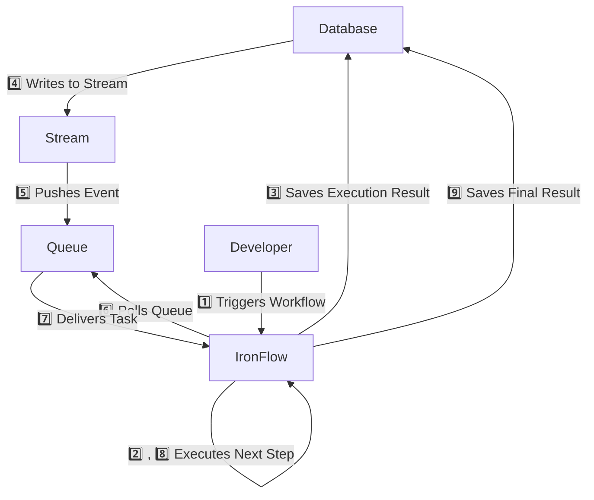

# IronFlow

A **lightweight, durable workflow execution engine** designed for flexibility and scalability.  
IronFlow can run **anywhere**, requiring only **two database tables** (one for workflow executions, one for node executions) and a **messaging queue**.

It uses [JMESPath](https://jmespath.org) to efficiently pass data between workflow nodes.

---

## 🚀 Supported Tech Stacks

### **Persistence**
- ✅ AWS DynamoDB
- 🔄 PostgreSQL *(coming soon)*

### **Queue**
- ✅ AWS SQS
- 🔄 RabbitMQ *(coming soon)*

---

## ✨ Features

- **🔄 Durable Workflows** – Handle complex, long-running tasks with built-in state management and retries.
- **⚡ Execution Flexibility** – Deploy **anywhere** using your preferred database and queue system.
- **🛠 Fault Tolerance & Retry Logic** – Automatic retries and error handling for reliable execution.
- **☁️ AWS Integration** – Supports **DynamoDB Streams, SQS, and AWS Lambda** for seamless cloud-based workflows.
- **💡 Open Source** – Actively maintained, and **contributions are welcome!**

---

## 🧩 Supported Workflow Nodes

- **HTTP** – Send HTTP requests to external services.
- **Lambda** – Invoke AWS Lambda functions.
- **Condition** – Implement **if/else** branching logic.
- **Branch** – Execute parallel tasks with optional conditions.
- **Loop** – Run a set of nodes in a loop for iterative processing.
- **Workflow** – Trigger **chained workflow executions** for modular design.
---

## Basic Architecture

---

### 📌 Get Started

🔹 Coming soon: **Installation Guide & Examples**

👥 Join the community & contribute: **[GitHub Repository](#)**

🚀 **IronFlow – Build Durable, Scalable Workflows!**

### AWS Integration
 1. Deploy cloudformation stack located in [ironflow.yaml](https://github.com/ErenKizilay/ironflow/blob/main/.cloudformation/ironflow.yaml).
 2. Deploy Lambda function [ironflow_dynamodb_streams](https://github.com/ErenKizilay/ironflow_dynamodb_streams) to route DynamoDB records to SQS
 3. Add ironflow_node_executions table as event trigger for ironflow_dynamodb_streams lambda function

