# IronFlow

A **lightweight, durable workflow execution engine** designed for flexibility and scalability.  
IronFlow can run **anywhere**, requiring only **two database tables** (one for workflow executions, one for node executions) and a **messaging queue**.

It uses [JMESPath](https://jmespath.org) to efficiently pass data between workflow nodes.

---

## 🚀 Supported Tech Stacks

### **Persistence**
- ✅ AWS DynamoDB
- 🔄 PostgreSQL *(coming soon)*

### **Queue**
- ✅ AWS SQS
- 🔄 RabbitMQ *(coming soon)*

---

## ✨ Features

- **🔄 Durable Workflows** – Handle complex, long-running tasks with built-in state management and retries.
- **⚡ Execution Flexibility** – Deploy **anywhere** using your preferred database and queue system.
- **🛠 Fault Tolerance & Retry Logic** – Automatic retries and error handling for reliable execution.
- **☁️ AWS Integration** – Supports **DynamoDB Streams, SQS, and AWS Lambda** for seamless cloud-based workflows.
- **💡 Open Source** – Actively maintained, and **contributions are welcome!**

---

## 🧩 Supported Workflow Nodes

- **HTTP** – Send HTTP requests to external services.
- **Lambda** – Invoke AWS Lambda functions.
- **Condition** – Implement **if/else** branching logic.
- **Branch** – Execute parallel tasks with optional conditions.
- **Loop** – Run a set of nodes in a loop for iterative processing.
- **Workflow** – Trigger **chained workflow executions** for modular design.
- **Assertion** – Evaluates a provided JMESPath expression against the current context to validate expected results.

---

## 🔗 Use Cases

- **API Testing** – Use HTTP and Assertion nodes to construct complex test cases and validate API responses efficiently.
- **Serverless Function Orchestration** – Build reusable serverless functions and invoke them through workflows to implement advanced automation and business logic.
- **Data Processing Pipelines** – Chain together multiple processing steps to transform, validate, and analyze data streams in a structured workflow.
- **Event-Driven Automation** – Trigger workflows based on incoming events from queues, databases, or external services to automate business operations.
- **Scheduled Task Execution** – Automate recurring jobs such as database backups, report generation, or maintenance tasks on a predefined schedule.
- **Microservices Coordination** – Orchestrate interactions between microservices, ensuring data flows correctly and tasks are executed in the right order.

---

## 🔄 Reliability & Execution Guarantees

IronFlow is built with robust execution semantics to ensure workflows run reliably and predictably:

- **Durable Executions** – Workflows persist their state, ensuring progress is maintained even in case of failures or restarts.
- **Idempotency** – Workflow steps can be retried safely without causing unintended side effects, ensuring correctness.
- **Automatic Retries** – Failed workflow steps are retried based on configurable policies, minimizing disruptions.
- **Consistency** – Execution results are stored reliably, and transitions between workflow states follow strict consistency rules.

These features enable IronFlow to handle long-running workflows, distributed systems, and fault-tolerant execution with ease. 🚀


## Basic Architecture

```mermaid
graph TD;
    DB[Database]
    IronFlow
    Queue
    Stream
    Dev[Developer]
    
    Dev -->|1️⃣ Triggers Workflow| IronFlow
    IronFlow -->|2️⃣ Executes Step| IronFlow
    IronFlow -->|3️⃣ Saves Execution Result| DB
    DB -->|4️⃣ Writes to Stream| Stream
    Stream --> |5️⃣ Pushes Event| Queue
    IronFlow -->|6️⃣ Polls Queue| Queue
    Queue -->|7️⃣ Delivers Task| IronFlow
    IronFlow -->|2️⃣ , 8️⃣ Executes Next Step| IronFlow
    IronFlow -->|9️⃣ Saves Final Result| DB
```



---

### 📌 Get Started

🔹 Coming soon: **Installation Guide & Examples**

🐳 Docker: https://hub.docker.com/r/erenkzly/ironflow

👥 Join the community & contribute: **[GitHub Repository](#)**

🚀 **IronFlow – Build Durable, Scalable Workflows!**

### AWS Integration
 1. Deploy cloudformation stack located in [ironflow.yaml](https://github.com/ErenKizilay/ironflow/blob/main/.cloudformation/ironflow.yaml).
 2. Deploy Lambda function [ironflow_dynamodb_streams](https://github.com/ErenKizilay/ironflow_dynamodb_streams) to route DynamoDB records to SQS
 3. Add ironflow_node_executions table as event trigger for ironflow_dynamodb_streams lambda function

---

## 🛠 Example Workflow: Opsgenie Alert Handling

The following example demonstrates how IronFlow can automate an **Opsgenie alert lifecycle**, from creation to resolution.

### 📜 Workflow Definition

```yaml
name: opsgenie
config:
  auth_providers:
    - opsgenie
nodes:
  - !Http
    id: create_alert
    url: https://api.opsgenie.com/v2/alerts
    method: POST
    body:
      message: "{{input.message}}"
      description: "{{input.description}}"
  - !Http
    id: get_request
    url: "{{join('', ['https://api.opsgenie.com/v2/alerts/requests/', create_alert.body.requestId])}}"
    method: GET
  - !Condition
    id: if_created
    expression: "{{get_request.body.data.isSuccess}}"
    true_branch:
      - !Http
        id: ack_alert
        url: "{{join('', ['https://api.opsgenie.com/v2/alerts/', get_request.body.data.alertId, '/acknowledge'])}}"
        method: POST
        body:
          note: "Acknowledged automatically"
      - !Http
        id: close_alert
        url: "{{join('', ['https://api.opsgenie.com/v2/alerts/', get_request.body.data.alertId, '/close'])}}"
        method: POST
        body:
          note: "Resolved automatically"
      - !Http
        id: add_note_to_alert
        url: "{{join('', ['https://api.opsgenie.com/v2/alerts/', get_request.body.data.alertId, '/notes'])}}"
        method: POST
        body:
          note: "A note from IronFlow"
      - !Http
        id: add_tags_to_alert
        url: "{{join('', ['https://api.opsgenie.com/v2/alerts/', get_request.body.data.alertId, '/tags'])}}"
        method: POST
        body:
          tags:
            - "automated"
            - "{{add_note_to_alert.body.requestId}}"
      - !Http
        id: get_alert
        url: "{{join('', ['https://api.opsgenie.com/v2/alerts/', get_request.body.data.alertId])}}"
        method: GET
      - !Assertion
        id: assert_alert_fields
        assertions:
          - !Equals
            left: "{{get_alert.body.data.message}}"
            right: "{{input.message}}"
          - !Equals
            left: "{{get_alert.body.data.description}}"
            right: "{{input.description}}"
          - !Equals
            left: "{{contains(get_alert.body.data.tags, 'automated')}}"
            right: true
          - !Equals
            left: "{{contains(get_alert.body.data.tags, add_note_to_alert.body.requestId)}}"
            right: true
          - !Equals
            left: "{{get_alert.body.data.acknowledged}}"
            right: true
          - !Equals
            left: "{{get_alert.body.data.status}}"
            right: "closed"

```           


---

## 🚀 Running a Workflow

This is the example curl to start a workflow execution:

```sh
curl --location 'http://localhost:3000/workflows/{{workflow_name}}/executions' \
--header 'Content-Type: application/json' \
--data '{
    "message": "a message",
    "description": "a description"
}'
```

## Running IronFlow

Example config.yaml:
```yaml
config_options:
  auth_provider_source: !Local
    resources/auth.yaml
  workflow_source: !Local
    resources/workflows
lister_config:
  poll_interval_ms: 300
  queue_provider: InMemory  # Replace with the actual queue provider for ex: SQS
  message_visibility_timeout_sec: 60  # Example: message visibility timeout of 60 seconds
persistence_config:
  provider: InMemory  # Replace with the persistence provider you use (e.g., DynamoDb, PostgreSQL)
execution_config:
  max_workflow_chain_depth: 10  # Set the max depth for workflow chains
api_config:
  port: 3000  # Port where the API will run
```
⚠️ **Warning:** InMemory _queue_provider_ and _persistence_provider_ is for testing and exploring IronFlow quickly.


```sh
Pull image
docker pull erenkzly/ironflow:1.0.0 
```
Example folder structure
- **/path/to/**
  - workflows
    - workflow1.yaml
    - workflow1.yaml
  - auth.yaml
```sh
Run container
docker run --rm -p 3000:3000 -v /path/to/workflows:/resources -v /path/to/config/local.yaml:/opt/ironflow/config.yaml erenkzl7/ironflow:1.0.0
```


